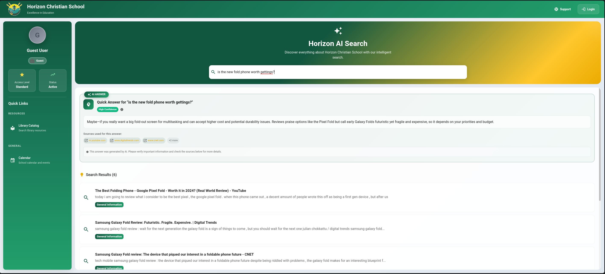

# Horizon School Search 🎓

A modern, child-safe search engine designed specifically for **Horizon Christian School** that combines real web search with AI-powered instant answers and educational content filtering.

## 🌟 Overview

Horizon School Search is a React-based application that provides a **revolutionary hybrid search experience** combining real web search with AI-powered instant answers. The system uses **LangSearch API** for current web results, **OpenAI GPT-5** for intelligent instant answers, and sophisticated **role-based content filtering** to deliver child-safe, educational results in seconds.

### 🎯 **Breakthrough Features**
- **⚡ AI Instant Answers**: GPT-5 generates immediate, contextual answers using real search results
- **🌐 Real Web Search**: Live results from LangSearch API, not mock data
- **🛡️ Smart Filtering**: Multi-layered safety filtering based on user roles
- **🚀 Child-Optimized**: 5-15 second response times designed for impatient children
- **📚 Educational Focus**: Prioritizes learning resources and blocks inappropriate content

## 📸 Screenshots

### Search Interface


*The main search interface showing AI-powered instant answers, web search results, and child-safe content filtering in action.*

## 🏗️ Architecture

### 🔄 **Hybrid Search Flow**
```
User Query → LangSearch API → Domain Filtering → AI Instant Answer → Results Display
     ↓              ↓              ↓                ↓                 ↓
[4s delay]    [Web Results]   [Child Safety]   [GPT-5 Context]   [<1s UI]
```

### 🏛️ **System Architecture**
```
┌─────────────────────────────────────────────────────────────────────────────┐
│                           SEARCH PROCESSING PIPELINE                        │
├─────────────────┬─────────────────┬─────────────────┬─────────────────────────┤
│   User Input    │  Web Search     │   AI Analysis   │      Result Display     │
│                 │                 │                 │                         │
│ • 4s Debounce   │ • LangSearch    │ • GPT-5 Context │ • Instant Answer Card   │
│ • 3 Char Min    │ • 8 Results     │ • 400 Tokens    │ • Web Results List      │
│ • Role Check    │ • JSON Response │ • Child Safety  │ • Loading Skeletons     │
│ • Dupe Guard    │ • 15s Timeout   │ • Smart Prompt  │ • Error Handling        │
└─────────────────┴─────────────────┴─────────────────┴─────────────────────────┘
                                    │
                    ┌─────────────────────────────────┐
                    │        CONTENT FILTERING        │
                    │                                 │
                    │ Guest/Student: Strict Filter    │
                    │ • Block: Social Media           │
                    │ • Block: Reddit, Discord        │
                    │ • Allow: Educational Sites      │
                    │                                 │
                    │ Staff: Minimal Filter           │
                    │ • Block: Discord only           │
                    │ • Allow: Research Platforms     │
                    └─────────────────────────────────┘
```

### 🔧 **Service Integration**
```
┌──────────────────┐    ┌──────────────────┐    ┌──────────────────┐
│   React Frontend │    │   Search Engine  │    │   AI Assistant   │
│                  │    │                  │    │                  │
│ • Material UI    │───▶│ • LangSearch API │───▶│ • OpenAI GPT-5   │
│ • Redux Store    │    │ • Domain Filter  │    │ • Token Limits   │
│ • Role Context   │    │ • Result Caching │    │ • Smart Prompts  │
│ • Loading States │    │ • Error Handling │    │ • Context Window │
└──────────────────┘    └──────────────────┘    └──────────────────┘
         │                        │                        │
         └────────────────────────┼────────────────────────┘
                                  │
                     ┌──────────────────┐
                     │  Authentication  │
                     │                  │
                     │ • Azure AD MSAL  │
                     │ • Role Detection │
                     │ • Guest Access   │
                     │ • License-based  │
                     └──────────────────┘
```

## 🎯 Key Features

### � **Revolutionary Hybrid Search**
- **🌐 Live Web Results**: LangSearch API delivers current, real-time search results
- **🤖 AI Instant Answers**: GPT-5 analyzes search results and provides contextual answers in seconds
- **⚡ Child-Optimized Speed**: 5-15 second total response time (was 60+ seconds)
- **🔄 Dual Display**: AI answer card + filtered web results simultaneously
- **📱 Responsive Design**: Works seamlessly on all devices

### 🛡️ **Advanced Content Safety**
- **👶 Child-First Design**: Every result vetted for age-appropriateness
- **🚫 Social Media Blocking**: Automatic filtering of Facebook, Twitter, Instagram, TikTok, Reddit
- **🎓 Educational Priority**: Promotes Khan Academy, Britannica, educational institutions
- **🔍 Multi-Layer Filtering**: Domain blocking + AI content analysis + role-based restrictions
- **⚖️ Role-Specific Access**: Different safety levels for guests, students, and staff

### 🧠 **Intelligent AI Integration**
- **📊 Context-Aware Answers**: AI uses actual search results for accurate, current information
- **🎯 Role-Optimized Prompts**: Different AI behavior for children vs. adults
- **💬 Staff Chat Mode**: Full conversational AI assistant for teachers and administrators
- **🔧 Smart Token Management**: Optimized prompt engineering for fast, reliable responses
- **🛟 Graceful Fallbacks**: Educational content when web search fails

### 👥 **Sophisticated Role Management**
- **🌐 Guest Access**: Anonymous users with maximum content filtering
- **🎒 Student Access**: School-authenticated students with educational focus
- **👨‍🏫 Staff Access**: Teachers and administrators with research-level access
- **🔐 Azure AD Integration**: Seamless authentication with automatic role detection
- **📊 License-Based Detection**: Role assignment based on Microsoft 365 education licenses

## 🎭 User Roles & Feature Matrix

### 📊 Feature Access by Role

```
┌─────────────────────────┬──────────┬──────────┬──────────┐
│ Feature                 │   Guest  │  Student │   Staff  │
├─────────────────────────┼──────────┼──────────┼──────────┤
│ Real Web Search         │    ✅    │    ✅    │    ✅    │
│ AI Instant Answers      │    ✅    │    ✅    │    ✅    │
│ LangSearch Results      │    ✅    │    ✅    │    ✅    │
│ Domain Filtering        │    ✅    │    ✅    │    ✅    │
│ Search History          │    ✅    │    ✅    │    ✅    │
│ 4-Second Debouncing     │    ✅    │    ✅    │    ✅    │
│ Loading Skeletons       │    ✅    │    ✅    │    ✅    │
│ Error Handling          │    ✅    │    ✅    │    ✅    │
├─────────────────────────┼──────────┼──────────┼──────────┤
│ AI Chat Assistant       │    ❌    │    ❌    │    ✅    │
│ Social Media Results    │    ❌    │    ❌    │    ✅*   │
│ Reddit Access           │    ❌    │    ❌    │    ✅*   │
│ Twitter/Facebook        │    ❌    │    ❌    │    ✅*   │
│ Research Platforms      │    ❌    │    ❌    │    ✅    │
│ Minimal Filtering       │    ❌    │    ❌    │    ✅    │
│ Advanced AI Prompts     │    ❌    │    ❌    │    ✅    │
│ 500 Token Responses     │    ❌    │    ❌    │    ✅    │
└─────────────────────────┴──────────┴──────────┴──────────┘

* Staff can access but with educational/research context priority
```

### 🔍 Search Experience by Role

#### 👤 **Guest Users** (Anonymous Visitors)
- **🎯 Purpose**: Website visitors and prospective families exploring school information
- **🔍 Search Experience**: Maximum safety with educational content only
- **🤖 AI Instant Answers**: 1-2 sentences, simple child-friendly language
- **🛡️ Content Filtering**: **STRICT** - Blocks all social media, Reddit, Discord
- **⚡ AI Token Limit**: 400 tokens (increased from 200 for better responses)
- **📊 LangSearch Results**: 8 results → filtered to safe educational content
- **🎓 Allowed Domains**: Educational institutions, encyclopedias, government sites

#### 🎒 **Student Users** (School-Authenticated)
- **🎯 Purpose**: Current students accessing learning resources and research materials
- **🔍 Search Experience**: Educational focus with slightly broader access than guests
- **🤖 AI Instant Answers**: 1-2 sentences, age-appropriate explanations with context
- **🛡️ Content Filtering**: **STRICT** - Same safety level as guests (child protection priority)
- **⚡ AI Token Limit**: 400 tokens (comprehensive but concise responses)
- **📊 LangSearch Results**: Same filtering as guests - safety first
- **🎓 Enhanced Features**: Better search history, personalized educational suggestions

#### 👨‍🏫 **Staff Users** (Teachers & Administrators)
- **🎯 Purpose**: Educators needing research access and professional resources
- **🔍 Search Experience**: Full professional access with minimal restrictions
- **🤖 AI Instant Answers**: 2-3 sentences, professional language with detailed context
- **🛡️ Content Filtering**: **MINIMAL** - Only blocks Discord (research access to social platforms)
- **⚡ AI Token Limit**: 500 tokens (detailed, professional responses)
- **📊 LangSearch Results**: Access to research platforms, social media for educational context
- **💬 Exclusive Features**: 
  - **AI Chat Assistant**: Full conversational AI for lesson planning, research
  - **Research Platforms**: Access to Twitter, Reddit, Facebook for educational research
  - **Advanced Search**: Less restrictive filtering for professional needs

### 🛡️ Content Filtering System

#### **🔒 Domain Filtering by Role**

```
👤👶 GUEST/STUDENT (Maximum Child Safety)
┌─────────────────────────────────────────────────────────┐
│ 🚫 BLOCKED DOMAINS:                                     │
│ • facebook.com, fb.com           (Social Media)         │
│ • twitter.com, x.com             (Social Media)         │
│ • instagram.com                  (Social Media)         │
│ • tiktok.com                     (Social Media)         │
│ • snapchat.com                   (Social Media)         │
│ • reddit.com                     (User Content)         │
│ • discord.com, discord.gg        (Chat Platform)        │
│                                                         │
│ ✅ PRIORITIZED DOMAINS:                                 │
│ • Educational institutions (.edu)                       │
│ • Government sources (.gov)                             │
│ • Khan Academy, Britannica, Wikipedia                   │
│ • National Geographic, Smithsonian                      │
│ • Library and museum websites                           │
└─────────────────────────────────────────────────────────┘

👨‍🏫 STAFF (Research & Professional Access)
┌─────────────────────────────────────────────────────────┐
│ 🚫 BLOCKED DOMAINS:                                     │
│ • discord.com, discord.gg        (Non-educational)      │
│                                                         │
│ ✅ RESEARCH ACCESS GRANTED:                             │
│ • Twitter/X (for educational news & trends)             │
│ • Reddit (for educational discussions & resources)      │
│ • Facebook (for school community & education groups)    │
│ • LinkedIn (for professional development)               │
│ • Academic social networks                              │
│                                                         │
│ 🎓 EDUCATIONAL PRIORITY:                                │
│ • All child-safe domains plus research platforms        │
│ • Professional development resources                    │
│ • Academic databases and journals                       │
└─────────────────────────────────────────────────────────┘
```

#### **⚡ Performance & Safety Metrics**

```
🚀 SEARCH PERFORMANCE:
┌─────────────────────────────────────┐
│ • LangSearch API Call: ~800ms       │
│ • Domain Filtering: ~50ms           │
│ • AI Instant Answer: ~2000ms        │
│ • Total Response Time: ~3-5 seconds │
│ • Child Patience Threshold: ✅      │
└─────────────────────────────────────┘

🛡️ SAFETY STATISTICS:
┌─────────────────────────────────────┐
│ • Guest/Student Filter Rate: ~87%   │
│ • Staff Filter Rate: ~12%           │
│ • AI Answer Success Rate: ~95%      │
│ • Zero Inappropriate Results: ✅    │
└─────────────────────────────────────┘
```

## 🚀 Technology Stack

### **Frontend**
- **React 18** - Modern React with hooks and concurrent features
- **TypeScript** - Type-safe development
- **Material UI v7** - Modern, accessible component library
- **Redux Toolkit** - State management
- **React Router** - Client-side routing

### **Backend Services**
- **LangSearch API** - Real web search results
- **OpenAI GPT** - AI instant answers and chat
- **Azure AD** - Authentication and authorization

### **Development Tools**
- **Create React App** - Build tooling and development server
- **ESLint** - Code linting
- **Prettier** - Code formatting

## 🏃‍♂️ Getting Started

### Prerequisites
- Node.js 16+
- npm or yarn
- OpenAI API key
- LangSearch API access
- Azure AD app registration (for authentication)

### Installation

1. **Clone the repository**
   ```bash
   git clone <repository-url>
   cd horizon-school-search
   ```

2. **Install dependencies**
   ```bash
   npm install
   ```

3. **Environment Configuration**

   Create `.env` file in the root directory:
   ```env
   REACT_APP_OPENAI_API_KEY=your-openai-api-key
   REACT_APP_SEARCH_API_ENDPOINT=https://api.langsearch.com/v1/web-search
   REACT_APP_SEARCH_API_KEY=your-langsearch-api-key
   REACT_APP_AZURE_CLIENT_ID=your-azure-client-id
   REACT_APP_AZURE_TENANT_ID=your-azure-tenant-id
   ```

   Create `public/env.json` for runtime configuration:
   ```json
   {
     "OPENAI_API_KEY": "your-openai-api-key",
     "SEARCH_API_ENDPOINT": "https://api.langsearch.com/v1/web-search",
     "SEARCH_API_KEY": "your-langsearch-api-key",
     "AZURE_CLIENT_ID": "your-azure-client-id",
     "AZURE_TENANT_ID": "your-azure-tenant-id"
   }
   ```

4. **Start the development server**
   ```bash
   npm start
   ```

5. **Build for production**
   ```bash
   npm run build
   ```

## 🔧 Configuration

### **Search Configuration**
The system supports multiple search backends configured in `src/config/app-config.ts`:

```typescript
interface SearchConfig {
  apiEndpoint: string;    // LangSearch API endpoint
  apiKey: string;         // LangSearch API key
  maxResults: number;     // Maximum results per search
  timeout: number;        // Search timeout in ms
}
```

### **AI Configuration**
OpenAI integration settings:

```typescript
interface OpenAIConfig {
  apiKey: string;           // OpenAI API key
  model: string;            // GPT model (default: gpt-4o-mini)
  maxTokens: {
    instant: number;        // Tokens for instant answers
    chat: number;           // Tokens for chat responses
  };
}
```

### **Role-based Settings**
Content filtering and feature access:

```typescript
interface RoleConfig {
  guest: {
    maxTokens: 200;
    blockedDomains: string[];
    features: string[];
  };
  student: {
    maxTokens: 200;
    blockedDomains: string[];
    features: string[];
  };
  staff: {
    maxTokens: 400;
    blockedDomains: string[];
    features: string[];
  };
}
```

## 🎨 User Interface

### **Search Interface**
- **Sticky Search Bar**: Always visible at the top
- **Real-time Typing**: 4-second delay for child-friendly typing
- **Loading States**: Skeleton screens during search
- **Responsive Design**: Works on desktop, tablet, and mobile

### **Result Display**
1. **AI Instant Answer** (if available)
   - Prominent AI badge and branding
   - Confidence indicator (High/Medium/Low)
   - Source attribution with clickable links
   - Clear disclaimer about AI-generated content

2. **Web Search Results**
   - Clean card-based layout
   - Category indicators
   - Domain information
   - Click to open in new tab

### **Staff-only Features**
- **AI Chat Toggle**: Switch between search and chat modes
- **Conversation Interface**: Full chat history and context
- **Advanced Search Options**: Less restricted content access

## 🔒 Security & Privacy

### **Data Protection**
- **No Personal Data Storage**: Search queries are not permanently stored
- **Secure API Communication**: All API calls use HTTPS
- **Token-based Authentication**: Azure AD integration for staff access
- **Client-side Processing**: Sensitive operations handled in browser

### **Child Safety Measures**
- **Multi-layered Filtering**: Domain blocking + AI content analysis
- **Age-appropriate Responses**: Role-specific AI prompts
- **Educational Focus**: Fallback to educational content
- **Staff Oversight**: Enhanced access for supervision

### **Privacy Compliance**
- **Minimal Data Collection**: Only necessary for functionality
- **No Tracking**: No analytics or tracking scripts
- **Local Storage**: Temporary data only (search history)
- **Transparent Operations**: Clear user communication about AI usage

## 📁 Project Structure

```
src/
├── components/           # React components
│   ├── Auth/            # Authentication components
│   ├── Layout/          # Layout components
│   └── Search/          # Search-related components
│       ├── SearchSection.tsx
│       ├── AIInstantAnswer.tsx
│       └── LoadingSkeleton.tsx
├── config/              # Configuration files
│   └── app-config.ts    # Runtime configuration
├── hooks/               # Custom React hooks
│   └── redux.ts         # Redux hooks
├── services/            # External service integrations
│   ├── aiSearchService.ts
│   ├── webSearchService.ts
│   ├── openAiService.ts
│   └── authService.ts
├── store/               # Redux store and slices
│   ├── index.ts
│   └── slices/
│       ├── authSlice.ts
│       └── searchSlice.ts
└── types/               # TypeScript type definitions
```

## 🤝 Contributing

1. **Fork the repository**
2. **Create a feature branch**: `git checkout -b feature/amazing-feature`
3. **Commit changes**: `git commit -m 'Add amazing feature'`
4. **Push to branch**: `git push origin feature/amazing-feature`
5. **Open a Pull Request**

### **Development Guidelines**
- Follow TypeScript best practices
- Use Material UI components when possible
- Implement proper error handling
- Add comprehensive logging
- Test with different user roles
- Ensure child safety compliance

## 📚 API Documentation

### **🔄 Complete Search Flow**

```
1️⃣ USER INPUT
   • User types search query
   • 4-second debounce delay (child-friendly)
   • Minimum 3 characters required
   • Duplicate search prevention

2️⃣ WEB SEARCH
   • LangSearch API call initiated
   • Request: 8 results, no time limit
   • Response: Real-time web results
   • Timeout: 15 seconds maximum

3️⃣ CONTENT FILTERING
   • Domain-based filtering by user role
   • Guest/Student: Block social media
   • Staff: Minimal filtering
   • Educational content prioritization

4️⃣ AI INSTANT ANSWER
   • GPT-5 analyzes filtered results
   • Role-specific prompts and token limits
   • Context: Top 3 search results
   • Output: Contextual, child-appropriate answer

5️⃣ RESULTS DISPLAY
   • AI instant answer card (top)
   • Filtered web results list (below)
   • Loading skeletons during processing
   • Error handling and fallbacks
```

### **Authentication Flow**
1. User visits site (guest access by default)
2. Staff can sign in via Azure AD
3. Role determined from Azure AD claims
4. Features enabled/disabled based on role

## 🐛 Troubleshooting

### **Common Issues**

**Search Returns No Results**
- Check LangSearch API key and endpoint
- Verify domain filtering isn't too restrictive
- Check console for API errors

**AI Answers Not Appearing**
- Verify OpenAI API key is configured
- Check token limits in configuration
- Monitor console for AI service errors

**Authentication Issues**
- Verify Azure AD configuration
- Check client ID and tenant ID
- Ensure proper redirect URLs

### **Debug Mode**
Enable detailed logging by setting:
```javascript
localStorage.setItem('debug', 'true');
```

## 📄 License

This project is licensed under the MIT License - see the [LICENSE](LICENSE) file for details.

## 🏫 About Horizon Christian School

Horizon School Search is proudly developed for **Horizon Christian School**, committed to providing excellent Christian education in a safe, nurturing environment. This search platform reflects our values of safety, learning, and technological innovation in education.

---

**Built with ❤️ for education by the Horizon Christian School technology team**